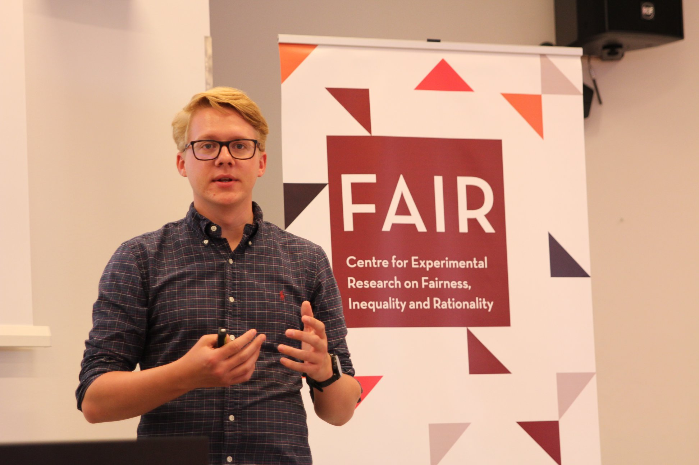

---
---

 

I am currently a second year PhD student at [FAIR CELE](https://www.nhh.no/en/research-centres/fair), which is part of the [Department of Economics](https://www.nhh.no/en/departments/economics) at the [Norwegian School of Economics](https://www.nhh.no/en) in Bergen. I hold a M.Sc from [The Norwegian School of Economics](https://www.nhh.no/en/), where I graduated in 2018.

My main interest lies in applied microeconomics with a special focus on labour and economic history. My main supervisor is [professor Kjell Gunnar Salvanes](https://sites.google.com/view/kjellsalvanes/home). 

 

**Email:** eirik[dot]berger[at]nhh.no  
**Twitter:** [\@eirikberger](https://twitter.com/eirikberger)  

This website is under construction, and will be updated soon.